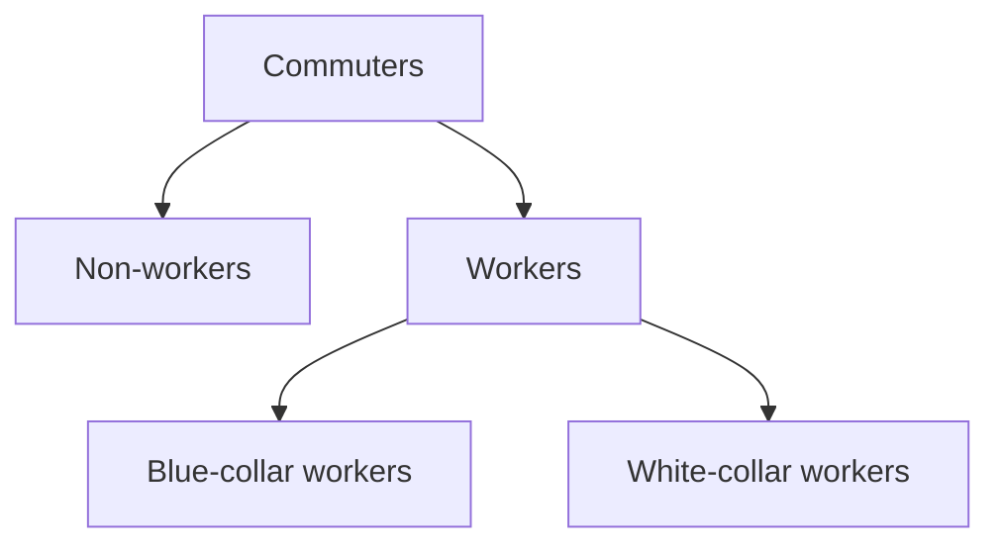

# On commuting to the office
## The Daily Grind
Today, while being stuck in traffic (again), trying to get into the office, I couldn't help but feel that the cumulative sum of time being wasted by everyone stuck in traffic for the same reason amounts to an infuriating inefficiency. This inefficiency is made even worse by the fact that there are so many negative externalities arising from it. People commuting needlessly are not only wasting fossil fuels, but also depreciating their cars, and more importantly, generating more traffic, which makes commuting even worse for the people that actually need to do it.  

### The Rationality Paradox
It's a waste, at all levels. How can this be happening, if a free market is supposed to be made of rational agents?  
Either we accept that economic agents aren't rational (which isn't that farfetched, when you look at certain individuals), or we need to approach this as a market inefficiency, and try to understand where that is coming from.
### The White Collar Conundrum
Where people are commuting needlessly, why is this happening in the first place?  
Let's try and split down common groups into broad categories, to make this analysis easier:

For the first group, the non-workers, I'll just accept that there's a reason. Be it leisure, education, or anything else.  
Blue collar workers, likewise. A plumber, a nurse, a chef, none of them can do their work from home, obviously.
Then we get to the white collar worker, or, broadly speaking, office workers. Here, the situation becomes more complex.  

For a number of roles involving collaborative work, being in the same physical space is genuinely necessary. Similarly, for any worker who feels more productive in the office (whether for physical or psychological reasons), commuting is rational.  
However, there's a significant group that remains: those who commute simply out of fear of losing their job. **Money is a very powerful motivator.**

Let's focus specifically on those who are at least as productive at home as they are in the office. For them, the only rationale for commuting appears to be job preservation. Each of them spends time and resources commuting, yet produces no additional output. From an economic perspective, this is clearly inefficient - or in simpler terms, _a waste of time and money_.
### Alternative Solutions
If this situation is economically inefficient, there must be alternatives where all parties benefit:  

1. *Different employers* could offer full remote work (or more flexible hybrid arrangements), immediately becoming more attractive to prospective **employees**.
2. *Employers* could offer slightly lower salaries in exchange for remote work, creating a net gain for both parties when accounting for eliminated commuting costs.
3. *Employers* could negotiate longer working hours in lieu of commuting time. If an **employee** saves two hours daily on commuting, working one additional hour benefits both parties - the *employer* gains extra worked hours, while the **employee** still saves time and commuting costs.

In this non-zero sum game, numerous solutions could improve upon the current status quo. Companies are leaving money on the table. Workers, who experienced this more beneficial equilibrium during pandemic lockdowns, would be happier. Happier workers are more productive, as demonstrated by studies on shorter working weeks. More productive workers, in turn, benefit employers.  

It's baffling that this inefficiency is actually widening, with RTO mandates increasing despite contrary evidence and data.
This suggests that markets are inefficient and imperfect, potentially requiring regulatory intervention. Or... is there something else?

## The Real Estate Connection: Why RTO is Being Pushed

### The Role of Quantitative Easing
A recurring hypothesis is that commercial real estate interests are driving mandatory RTO policies. Does this make sense? Could real estate owners truly wield such influence?  

To understand this, we need to look back to 2008. Since then, Central Banks have been "printing" money at unprecedented rates through quantitative easing, setting interest rates at 0% or even negative levels to encourage borrowing and investment - a central tenet of capitalism.  
The central banks have struggled to exit this policy. During the pandemic, they accelerated money creation dramatically. This money wasn't invested in physical capital (new machinery or factories), instead flowing into speculation. It went almost entirely into financial markets, explaining why, even as the world went into lockdown, stock prices and other assets (crypto, NFTs, real estate) reached all-time highs.  
### A Commercial Real Estate Bubble?
Simultaneously, remote work transformed overnight from "impossible" to standard practice. Companies (and office workers) suddenly realised that physical office space wasn't essential for most roles.

What happened to commercial real estate prices during this period? After the initial slump, they rose even faster and higher, before finally dropping significantly at the end of 2023.  
![[attachments/commuting to office-fredgraph1CNGX.webp|International Monetary Fund, Commercial Real Estate Prices for United States COMREPUSQ159N, retrieved from FRED, Federal Reserve Bank of St. Louis; fred.stlouisfed.org/series/COMREPUSQ159N|1000]]
  
  
When you look at the total amount of loans tied to commercial real estate, it paints a very interesting picture: ![[attachments/commuting to office-fredgraph1CNH9.webp|Board of Governors of the Federal Reserve System (US), Real Estate Loans: Commercial Real Estate Loans, All Commercial Banks CREACBW027SBOG, retrieved from FRED, Federal Reserve Bank of St. Louis; fred.stlouisfed.org/series/CREACBW027SBOG|1000]]
### The Vested Interests
These graphs reveal, in my opinion, a massive exposure to real estate. This is not just from companies owning office buildings (either for own use or to rent out), but also from banks making loans and other companies investing in securitised versions of these loans (which banks have collateralised into securities - not unlike the mortgage-backed securities of the 2008 sub-prime crisis). This could well be another bubble.  

All these companies have a vested interest in maintaining real estate prices. If prices fall, their investments lose value.  
No one wants to be left holding the bag when a bubble bursts.   
This explains the intensifying RTO push, particularly evident in late 2024 with companies like Amazon mandating five-day office attendance. Companies, and their executives, know this. They understand the stakes, and this compels them to prop up demand, by any means necessary.  

Even at the cost of making employees miserable.