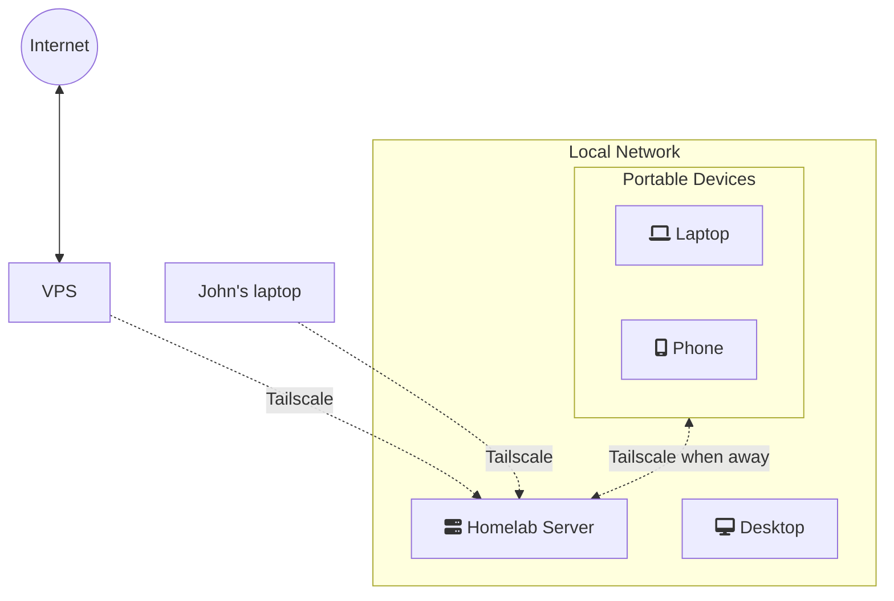

# Tailscale Access Controls
## What is Tailscale
[Tailscale](https://tailscale.com) is a nifty VPN tool, based on Wireguard, that allows you to set up safe, zero-zonfig, no-fuss connections between your devices. It's super easy to deploy, and it handles all the network shenanigans for you, making it an often recommended tool in the self-hosted community.

Tailscale's free plan allows up to 3 users and up to 100 devices, which is more than enough for most people doing any sort of homelab setups.

It really is almost entirely fool proof, and I'd strongly recommend it's use for anyone wanting to have access to their homelab from outside their local network, as it is an easy and free way to do it.

It can also be used to allow someone like a family member to access a service you are hosting locally. 

However, sometimes you need to do something a bit more complex. 
One such scenario is the one where you use a VPS (virtual private server) to proxy connections from the open internet to your homelab's self-hosted services.


## Introducing Access Controls
In this scenario, if you are using Tailscale to connect your homelab to the VPS, you do not want to give the VPS unrestricted access to your local network and services. You'll want to make sure that the VPS can only access the machines and services required for it to do what it needs to do (ie, proxying the connection). 
Tailscale has a really powerful way to control this via built in [ACLs (Access controls).](https://login.tailscale.com/admin/acls)

## How to set up the Tailscale Access Controls
Here I will provide a brief guide on how to set up a quick set of rules to limit connections between your Tailscale devices. This assumes that you already have your setup in place, with all the nodes running Tailscale. If you're doing this from scratch, you can assign tags directly when installing Tailscale on your devices and bringing them up online.

### The network layout
First, start by thinking about your network setup, and how what are the minimal accesses that your devices need in order to do their job.


Here, my VPS needs to be able to communicate with my Homelab, but it doesn't require direct access to any of my other devices.

John is a family member with whom you want to share a specific service you run locally on your homelab.

So let's go ahead and make sure each machine can only access what it needs. Go the [Tailscale ACLs)](https://login.tailscale.com/admin/acls) and let's setup the rules.
### Setting up Tags
```json
	// Define the tags which can be applied to devices and by which users.
	"tagOwners": {
		"tag:vps":   ["autogroup:admin"],	
		"tag:local":    ["autogroup:admin"],
	// Devices specific to users, like a Laptop, Phone or Desktop are untagged as they are linked only to the user rather than a "purpose"		
	},
```

​The above tags allow you to do a very simple setup. Once you add them on the Access Control and save your changes, you will be able to tag devices in the admin panel.

- Let's go ahead and tag our VPS as "vps".
- And then tag our Homelab server as "local".

The user devices are not tagged as they are specific to a user, rather than a purpose/function.

### Setting up Hosts (user's machines)
In the ACL you can easily give a host name to a specific machine, to allow for easier reading of the rules.
Let's say John is a family member who is part of your Tailscale network, and you wanted to give him access only to a specific service.

We start by adding his machine as a host:

```json
	"hosts": {
		"john": "100.1.2.3", // Specify the hostname to use on the rules, and the machine's Tailscale IP.
	},		
```

### The Access Control rules
Next, we need to put in the actual rules to control the accesses:

```json
	"acls": [
		// Allow all connections.
		// Comment this section out if you want to define specific restrictions.
		//{"action": "accept", "src": ["*"], "dst": ["*:*"]},
		{"action": "accept", "src": ["tag:vps"], "dst": ["tag:local:port1,port2"]}, // use * for all ports, or specify comma separated ports if you want to narrow it down for the services that you are using.
		{"action": "accept", "src": ["autogroup:admin"], "dst": ["*:*"]}, // Allows your "user" devices to connect to any other device (including your Homelab)
		{"action": "accept", "src": ["john"], "dst": ["tag:local:32400"]}, // Allows John's machine to connect your local service running on port 32400 only.
	],
	},
```

The `{"action": "accept", "src": ["tag:vps"], "dst": ["tag:local:port1,port2"]},` line ensures that the VPS can communicate with your Homelab (`tag:local`), but only on the specified `port1` and `port2`. Any service running on a different port, or a different device entirely, will not be accessible from the VPS.

The second line, `{"action": "accept", "src": ["autogroup:admin"], "dst": ["*:*"]},` allows any of your personal devices to connect to any other device. This means that you are still able to connect to your VPS via Tailscale (for example, to manage it), but the VPS would not be able to do the opposite and access your phone or laptop.

The third line, `{"action": "accept", "src": ["john"], "dst": ["tag:local:32400"]},` allows John's machine to *only* have access to your local server's service running on port 32400, as an example. He is unable to access anything else on your network!

Save, and that's it!

## Conclusion
Now your VPS can only connect to our Homelab server, while all our other devices can still connect amongst themselves. 

This way, if the VPS was compromised, the home network isn't immediately compromised - the malicious agents can only connect to the Homelab server, and only on the ports we have specified, rather than having an open door to you entire LAN.

You can also use this setup to give a family member (using Tailscale) access to one of your locally hosted services without giving them full access to your local network, by manually specifying their machine and what they should have access to.

This is just another layer of protection for self-hosted services, but an easy one to implement, and one I'd recommend to anyone using Tailscale in a similar scenario.